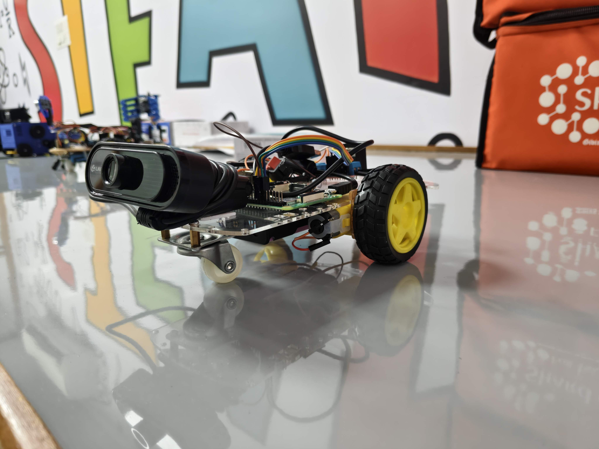
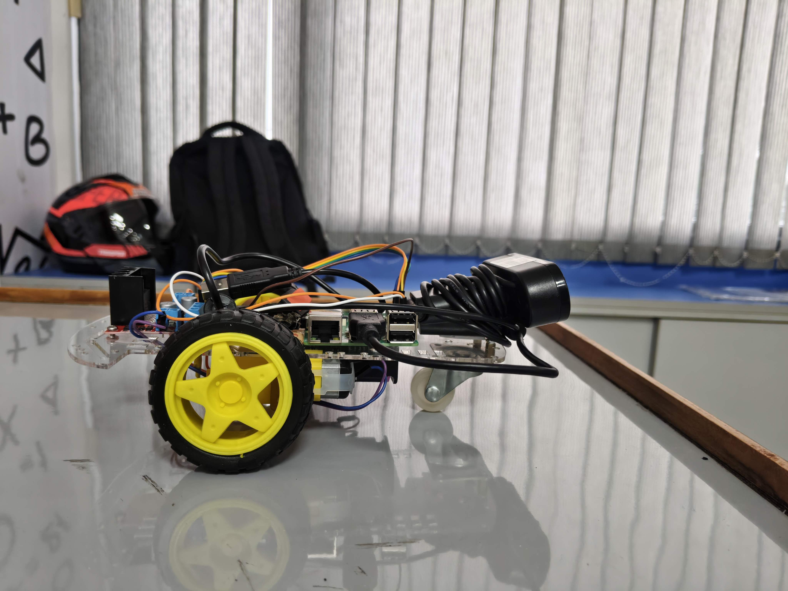
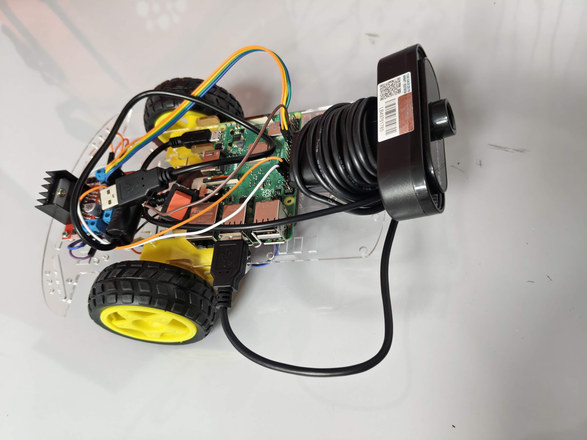

# 🤖 AI Hand-Controlled Car with Raspberry Pi (Headless Mode)

This project uses **computer vision** and **hand tracking** to control a motorized car using a Raspberry Pi. It detects your hand’s position and distance to guide the car — all **without any GUI window or camera preview**.

---

### 🚗 Features

- 👋 Real-time hand control using a webcam.
- 🧠 Built with `cvzone.HandTrackingModule`, `OpenCV`, and `RPi.GPIO`.
- ⚡ Motor control via PWM using L298N Motor Driver.
- 🖥️ No GUI — fully headless and runs via terminal.
- 🔌 Graceful shutdown and GPIO cleanup on exit.

---

### 🖼️ Car Setup Images

## Showcase Image
<p align="center">
  
</p>

##  Circuit Images
<p align="center">
  
  
</p>
---

### 🛠️ Hardware Required

| Component            | Notes                           |
|----------------------|----------------------------------|
| Raspberry Pi 3/4     | With Raspbian OS                 |
| USB Camera / Pi Cam  | Tested with Logitech C270        |
| L298N Motor Driver   | Dual H-Bridge                    |
| 2x DC Motors         | Connected to driver              |
| External Power Supply| For motors (6V–12V recommended)  |
| Jumper Wires         | For GPIO and power connections   |

---

### 🔌 GPIO Wiring

| Function         | GPIO Pin |
|------------------|----------|
| Motor A IN1      | GPIO 17  |
| Motor A IN2      | GPIO 18  |
| Motor B IN3      | GPIO 22  |
| Motor B IN4      | GPIO 23  |
| Motor A ENA (PWM)| GPIO 12  |
| Motor B ENB (PWM)| GPIO 13  |
| GND              | GND      |

---

### 📦 Installation

1. **Update Raspberry Pi**:
   ```bash
   sudo apt update && sudo apt upgrade

2. **Install Python dependencies**:
   ```bash
   pip3 install opencv-python numpy cvzone
   ```

3. **Enable camera interface** (if using PiCam):
   ```bash
   sudo raspi-config
   # Navigate to Interface Options > Camera > Enable
   ```

4. **Clone this repository**:
   ```bash
   git clone https://github.com/yourusername/hand-car-ai.git
   cd hand-car-ai
   ```

5. **Connect motors to GPIO**:
   - IN1 = GPIO17  
   - IN2 = GPIO18  
   - IN3 = GPIO22  
   - IN4 = GPIO23  
   - ENA = GPIO12 (PWM0)  
   - ENB = GPIO13 (PWM1)

---

### 📁 Project Structure

```
hand-car-ai/
├── hand_controlled_car.py   # Main script
└── README.md                # This file
```

---

### 🚦 Motion Logic

- **Left Zone (0%–20%)** → Turn Left
- **Right Zone (80%–100%)** → Turn Right
- **Center Zone (20%–80%)**:
  - Too Far → Move Forward
  - Too Close → Move Backward
  - Ideal Distance → Stay Still

Distance is calculated using pixel distance between hand landmarks and a calibrated formula.

---

### 🚀 Run the Script

```bash
sudo python3 hand_controlled_car.py
```

> ⚠️ Run as `sudo` to access GPIO and camera hardware.

---

### 🧯 Graceful Exit

- Press `Ctrl + C` to stop the program.
- Motors will stop and GPIO will be cleaned up.

---

### 🛠️ Motor Speed Tuning

If your car drifts or turns unevenly, calibrate motor speeds:

```python
BASE_LEFT_SPEED = 65    # Increase if left motor is slower
BASE_RIGHT_SPEED = 55   # Decrease if right motor is faster

TURN_LEFT_SPEED = 100
TURN_RIGHT_SPEED = 100
```

### 📜 License

This project is licensed under the **MIT License**.  
See the [LICENSE](LICENSE) file for details.

---

### 🙌 Acknowledgments

- [CVZone by Murtaza Hassan](https://github.com/cvzone/cvzone)
- [OpenCV](https://opencv.org/)
- [Raspberry Pi Foundation](https://www.raspberrypi.org/)
- [TensorFlow Lite](https://www.tensorflow.org/lite)
